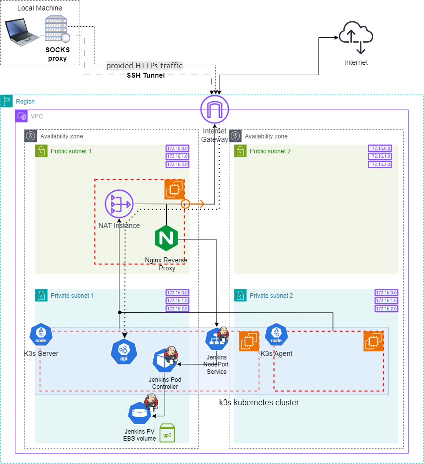

## RS School AWS DevOps Course

### _Configuration_

**Project Structure:**

```
├── .github
│   └── workflows
│       └── k3s.yml         <- github actions workflow
├── .gitignore
├── main.tf
├── nat_config.tf           <- NAT/Nginx config
├── k3s_server_config.tf    <- k3s server config
├── k3s_agent_config.tf     <- k3s agent config
├── ssh__kube_config.tf     <- ssh/kube configs (local setup)
├── ssh_config.tpl          <- ssh config template
├── backend.tf              <- backend configuration
├── variables.tf            <- input variables
└── ...
```

### Task 4 - Jenkins Installation and Configuration

- k3s kubernetes cluster is istalled within GitHub Actions workflow
- Jenkins installed with Helm within GitHub Actions workflow
- Jenkins uses EBS volume as persisten storage
- Jenkins is accessible via Intenet from private network through Nginx reverse proxy in NAT instance
- Jenkins `user` is created with restricted permissions as security measure

For more details please see PR: https://github.com/IlyaKozak/rsschool-devops-course-config/pull/1

**Jenkins Diagram:**  


### Infractructure

Infrastructure configuration provided in this repo (IaC) **https://github.com/IlyaKozak/rsschool-devops-course-infra**

**Usage:**

Add secrets `AWS_ROLE_TO_ASSUME`, `TF_VAR_K3S_TOKEN`, `TF_VAR_PRIVATE_KEY` and environment variable `AWS_REGION`, `TF_VAR_DOMAIN`, `TF_VAR_IS_LOCAL_SETUP`=`false`, `TF_VAR_PRIVATE_KEY_PATH` in GitHub repo for GitHub Actions workflow to run with `workflow_dispatch` => automatically `terraform apply` configuration for k3s and jenkins
