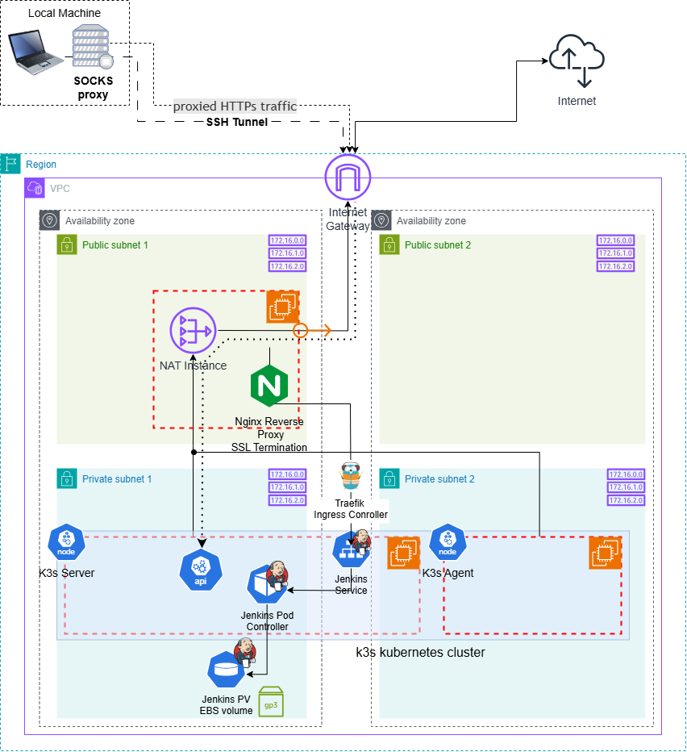

## RS School AWS DevOps Course - Configuration

**Project Structure:**

```
├── .github
│   └── workflows
│       └── k3s.yml         <- github actions workflow
├── .gitignore
├── main.tf
├── nat_config.tf           <- NAT/Nginx config
├── k3s_server_config.tf    <- k3s server config
├── k3s_agent_config.tf     <- k3s agent config
├── backend.tf              <- backend configuration
├── variables.tf            <- input variables
└── ...
```

<details>
<summary><strong>Task 7 - Prometheus Deployment on K8s</strong></summary>

- Prometheus is installed and running on the K8s cluster
- Installed prometheus `node-exporter` and `kube-state-metrics` jobs (exporters). `node-exporter` is dynamically discovered. `kube-state-metrics` is setup as a static scrape target https://github.com/IlyaKozak/rsschool-devops-course-config/blob/task-7-prometheus-deploy/k3s_server_config.tf#L143-L146
- Deployment is automated with [GitHub Actions CI/CD pipeline is created](https://github.com/IlyaKozak/rsschool-devops-course-config/actions/runs/12102954505/job/33744594616#step:7:411) https://github.com/IlyaKozak/rsschool-devops-course-config/blob/task-7-prometheus-deploy/k3s_server_config.tf#L148-L158
- Metrics can be checked via Prometheus web interface locally with `port-forwarding`
- Prometheus is collecting essential cluster-specific metrics, such as nodes' memory usage (memory, disk, cpu, ...)

For more details please see PR: https://github.com/IlyaKozak/rsschool-devops-course-config/pull/2

</details>

<details>
<summary><strong>Task 4 - Jenkins Installation and Configuration</strong></summary>

- k3s kubernetes cluster is istalled within GitHub Actions workflow
- Jenkins installed with Helm within GitHub Actions workflow
- Jenkins uses EBS volume as persisten storage
- Jenkins is accessible via Internet from private network through Nginx reverse proxy in NAT instance
- Jenkins `user` is created with restricted permissions as security measure

For more details please see PR: https://github.com/IlyaKozak/rsschool-devops-course-config/pull/1

**Diagram:**  


</details>

<hr />

### Infractructure

Infrastructure configuration provided in this repo (IaC) **https://github.com/IlyaKozak/rsschool-devops-course-infra**

**Usage:**

Add secrets `AWS_ROLE_TO_ASSUME`, `TF_VAR_K3S_TOKEN`, `TF_VAR_PRIVATE_KEY`, `TF_VAR_SSL_CERT`, `TF_VAR_SSL_KEY` and environment variable `AWS_REGION`, `TF_VAR_DOMAIN`, `TF_VAR_IS_LOCAL_SETUP`=`false`, `TF_VAR_PRIVATE_KEY_PATH` in GitHub repo for GitHub Actions workflow to run with `workflow_dispatch` ➤ automatically `terraform apply` configuration for k3s and jenkins
